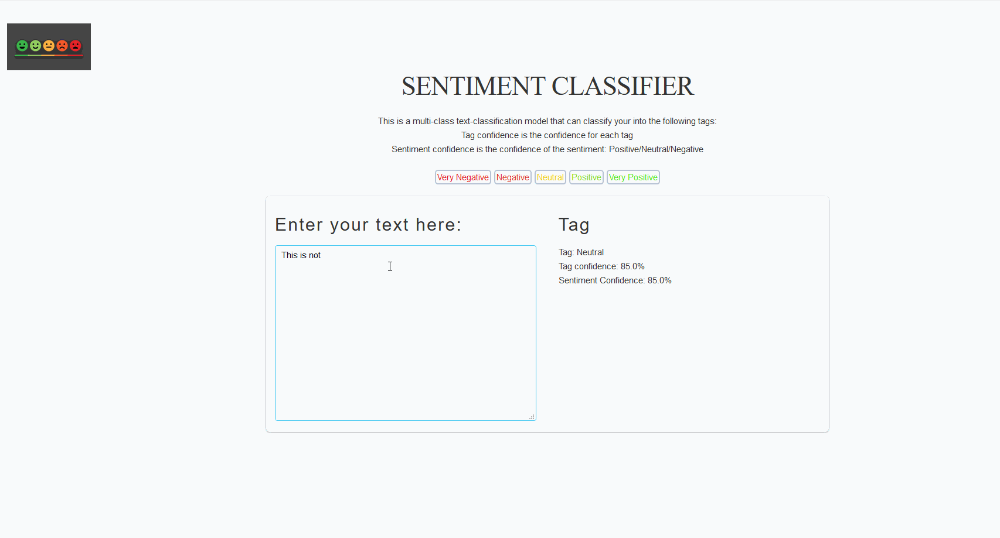

# Sentiment Analysis App

## About this app

This is a [sentiment analysis](https://en.wikipedia.org/wiki/Sentiment_analysis) model, deployed to a [dash](https://plotly.com/dash/) webapp.    
Users can input the text in the text box and get the sentiment of the text classified.

- **Sentiments**: `Negative`, `Neutral`, `Positive`    

- **Tags**: `Very Negative`, `Negative`, `Neutral`, `Positive`, `Very Positive`    

## How to run this app

(The following instructions apply to Posix/bash. Windows users should check
[here](https://docs.python.org/3/library/venv.html).)

First, clone this repository and open a terminal inside the root folder.

Create and activate a new virtual environment (recommended) by running
the following:

```bash
python3 -m venv myvenv
source myvenv/bin/activate
```

Install the requirements:

```bash
pip install -r requirements.txt
```
Run the app:

```bash
python app.py
```
Open a browser at http://127.0.0.1:8050

## Demo



## Resources

The dataset is available at the [Stanford NLP website](https://nlp.stanford.edu/sentiment/code.html)    
Model trained on Google Colab here: https://colab.research.google.com/drive/1R8C37FCryBpRRmRn_k5Jn0DSHAULLRAi    
The model's saved weights and json is available in the `model` folder.

----